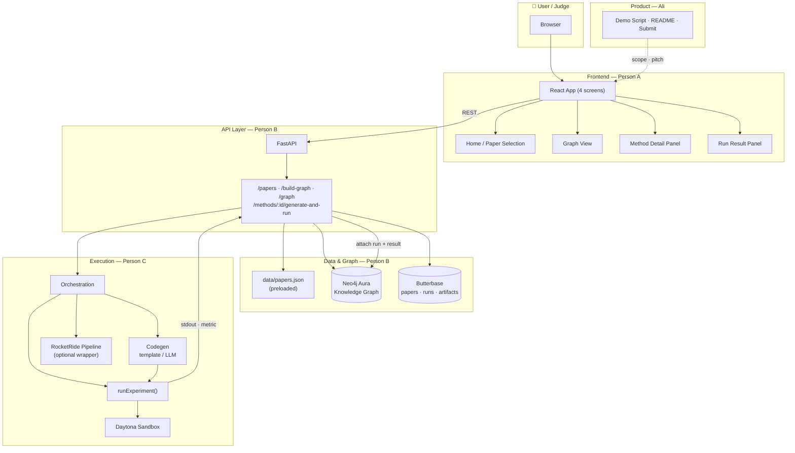
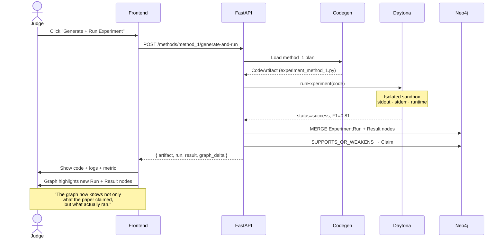
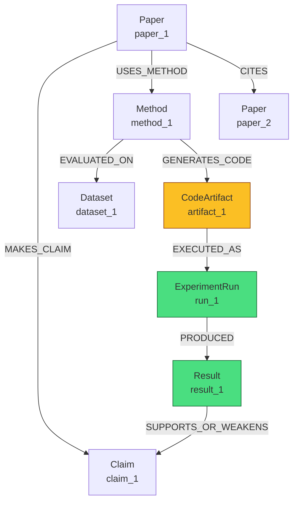
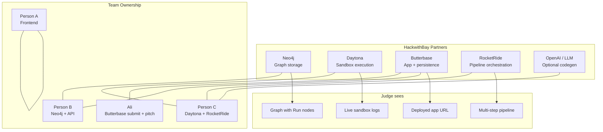
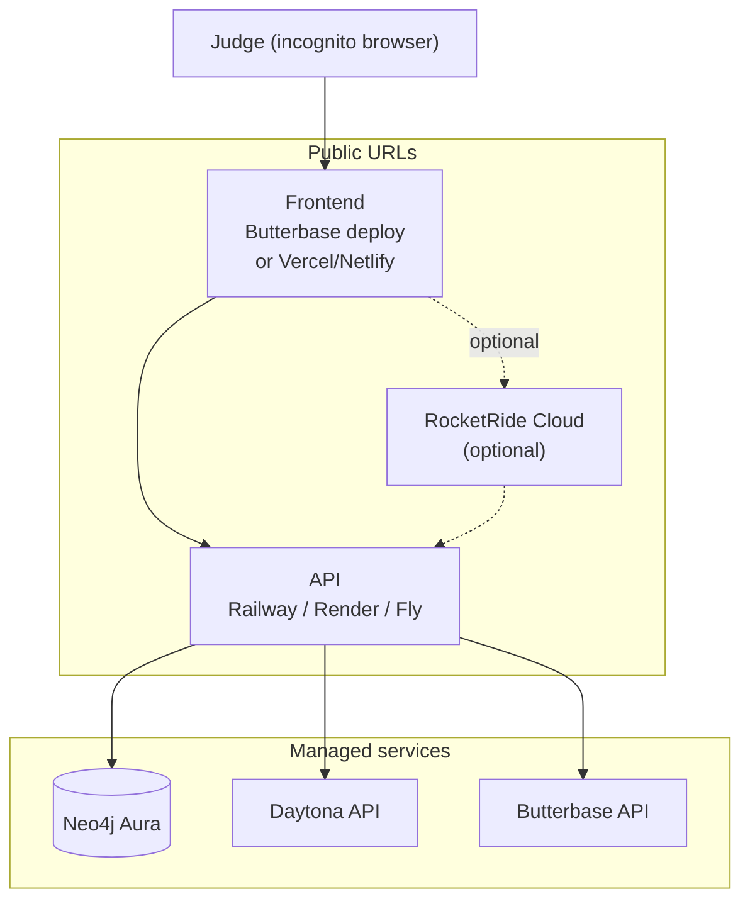
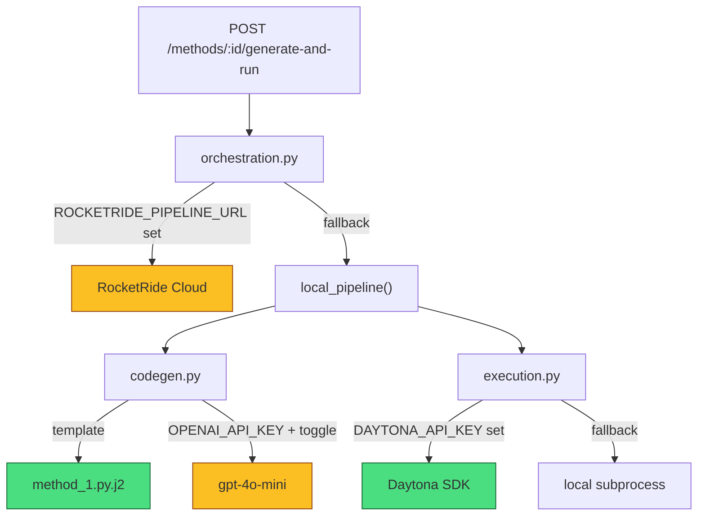
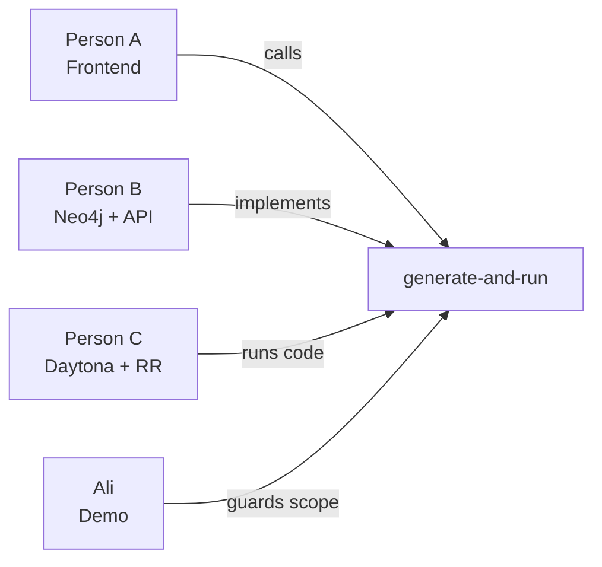
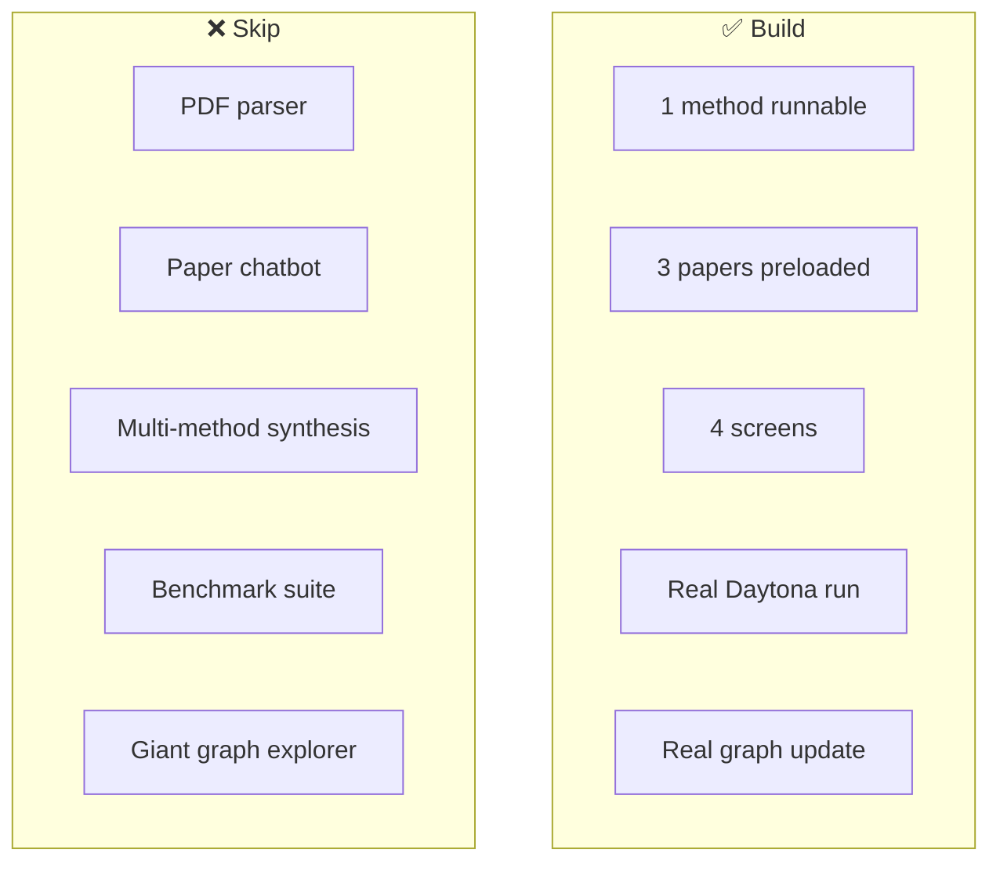

# Paper2Result — Architecture

> **Paper → Claim → Method → Code → Sandbox Run → Result → Graph Update**

This document describes the hackathon architecture for [Paper2Result](https://github.com/ali-amjad52114/Paper2Result). Optimized for a **4-person team**, **one demo loop**, and **sponsor clarity**.

---

## 1. High-Level System Architecture



---

## 2. Winning Demo Loop (Sequence)

The **one feature that must work**:



---

## 3. Four Screens → API → Backends

```mermaid
flowchart LR
    subgraph S1["Screen 1: Home"]
        P1["List 3 papers"]
        B1["Build Research Graph"]
    end

    subgraph S2["Screen 2: Graph"]
        G1["Force graph viz"]
        G2["Click Method node"]
    end

    subgraph S3["Screen 3: Method Panel"]
        M1["Claim + plan"]
        M2["Generate + Run"]
    end

    subgraph S4["Screen 4: Run Result"]
        R1["Code file"]
        R2["Sandbox logs"]
        R3["Metric + graph update"]
    end

    B1 -->|POST /build-graph| Neo4j[("Neo4j")]
    G1 -->|GET /graph| Neo4j
    M2 -->|POST /generate-and-run| Pipeline
    R3 -->|graph_delta| Neo4j

    subgraph Pipeline["Execution Pipeline"]
        Pipeline --> Codegen2["Template codegen"]
        Codegen2 --> Daytona2["Daytona"]
        Daytona2 --> Attach["Attach to graph"]
    end
```

---

## 4. Knowledge Graph Model (Neo4j)



**Green nodes** appear **after** the demo run. **Yellow** = generated at run time.

---

## 5. Sponsor / Tool Mapping



| Sponsor | Role in Paper2Result | Owner | Demo proof |
|---------|----------------------|-------|------------|
| **Neo4j** | Papers, claims, methods, runs, results | Person B | Graph updates after run |
| **Daytona** | Isolated code execution | Person C | Real stdout + runtime |
| **RocketRide** | generate → run → graph update | Person C | Observable pipeline waves |
| **Butterbase** | Deployed UI, run history, submission | Ali / B | Live URL + `app_id` |
| **OpenAI** | Optional LLM codegen | Person C | Template-first for reliability |

---

## 6. Deployment Architecture



**Minimum for submission:** Frontend URL + GitHub repo. API can be same origin or separate HTTPS endpoint.

---

## 7. Fallback / Abstraction Layers



| Layer | Primary | Fallback | Label in demo |
|-------|---------|----------|---------------|
| Orchestration | RocketRide pipeline | FastAPI sequential | Document in README |
| Codegen | Jinja2 template | LLM | "Template-generated" |
| Execution | Daytona | Local subprocess | Badge if simulated |

---

## 8. Team Integration Contract

All four people integrate through **one endpoint**:

```
POST /api/methods/method_1/generate-and-run
```

**Response shape (freeze at hour 1):**

```json
{
  "artifact": {
    "id": "artifact_1",
    "filename": "experiment_method_1.py",
    "content": "..."
  },
  "run": {
    "id": "run_1",
    "status": "success",
    "stdout": "F1 score: 0.81",
    "stderr": "",
    "runtime_seconds": 4.2,
    "sandbox_provider": "daytona"
  },
  "result": {
    "metric_name": "F1 Score",
    "metric_value": 0.81,
    "summary": "Generated implementation ran successfully on toy data."
  },
  "graph_delta": {
    "nodes": [...],
    "edges": [...]
  }
}
```



---

## 9. What We Are NOT Building



---

## Related docs

- [Execution Plan](./EXECUTION_PLAN.md) — full hackathon plan, task board, risks
- [README](../README.md) — project overview
